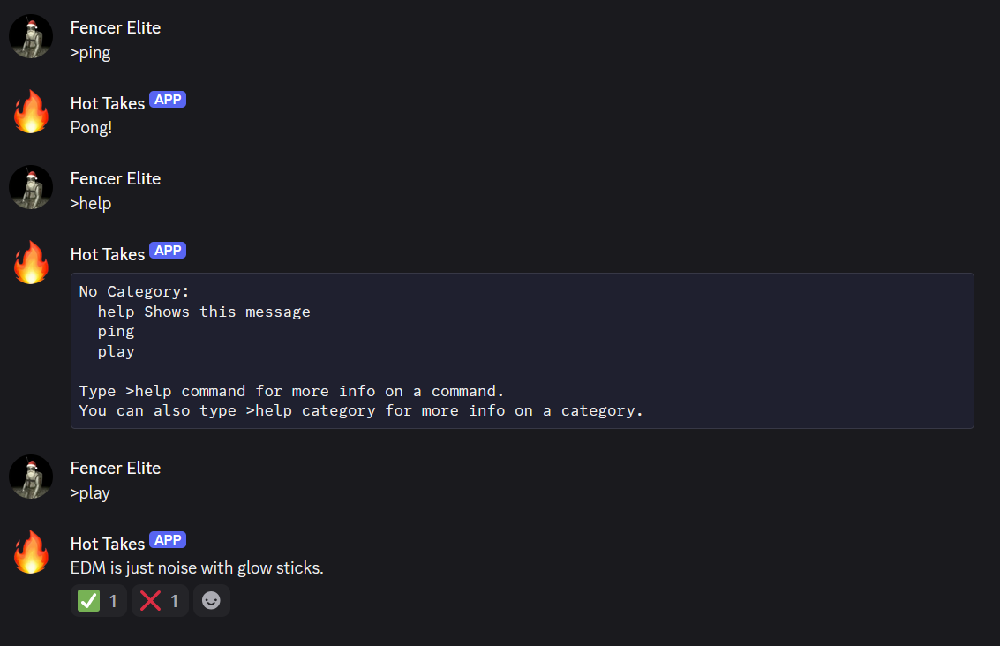

# Hot Takes

**Hot Takes** is a fun and engaging Discord bot that delivers bold, lighthearted, and mildly controversial opinions for the community to react to. From “Pineapple is the best pizza topping 🍍” to quirky random takes, it’s perfect for sparking fun debates!  

Players can use the `>play` command to get a random hot take. The community can then react with:  
- ✅ if they agree  
- ❌ if they disagree  

---

# Screenshots

---

# Try it
Invite the bot to your server using this link: https://discord.com/oauth2/authorize?client_id=1453392686676443188&permissions=67648&integration_type=0&scope=bot

**Note:** Make sure the bot has the following permissions:  
- Send Messages  
- Read Messages  
- Add Reactions  

---

# Technologies used
- **Python**  
- **discord.py**  
- Various supporting libraries  

---

# Improvements and future goals
- Add more topics for variety  
- Integrate a proper database instead of using text files  
- Consider automating topic scraping from the internet  

Contributions and suggestions are **highly welcome**!  

---

# ⭐ Feel free to star this repo
If you enjoy the bot, don’t forget to **star this repository**!  
